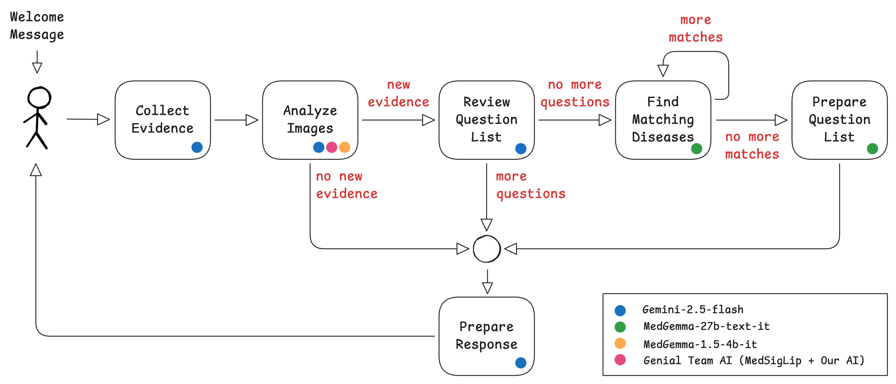

# AI-Powered Medical Condition Search Assistant



Genial Team Assistant is an intelligent search and informational tool designed to bridge the gap between patient-reported symptoms and medical knowledge. It provides a smart, efficient, and interactive way to explore potential matching diseases based on user-reported conditions and clinical images.

By combining multi-modal Vision-Language Models (VLM) with specialized classifiers, our assistant offers a streamlined way to navigate medical data and identify conditions that align with a patient's situation.

---

## 🌟 Key Features

- **Multi-modal Condition Search**: Explore information by chatting about symptoms or uploading medical images (skin photos, lab results, X-rays).
- **Intelligent Condition Matching**: A specialized agentic state-machine that asks targeted follow-up questions to efficiently narrow down matching medical conditions.
- **Advanced Image Analysis**: Integrated Vision AI that generates clinical descriptions and identifies potential matching diseases.
- **Structured Knowledge Summaries**: Automatically organizes findings into clear summaries for both patients (plain language) and clinical review (technical terminology).

---

## 🏗️ Architecture

The application is a monorepo composed of three core microservices orchestrated by Docker Compose:

1.  **Frontend (Next.js)**: A responsive React interface for real-time interaction and secure image handling.
2.  **Backend (FastAPI & LangGraph)**: The orchestration layer. It manages the search logic using a state-graph and integrates multiple LLMs (Gemini, MedGemma) to process conditions.
3.  **Genial Team AI (PyTorch)**: A dedicated microservice running a custom vision model (MedLIP 80-Diseases Classifier based on MedSigLip) for specialized disease classification with visual signs on the skin. Please note that the model weights provided in this repository are a simpler version (available on [HuggingFace](https://huggingface.co/genial-team/medsiglip-80-diseases-classifier)), trained on a reduced dataset and supporting a lower number of diseases. The final, optimized weights will be utilized in the live demonstration of the application.

---

## 🚀 Getting Started

### Prerequisites

- **Docker & Docker Compose**
- **NVIDIA Container Toolkit** (Required for GPU acceleration in the AI microservice)
- **API Keys**:
    - **Google Gemini API Key** (for general reasoning and report generation)
    - **MedGemma API access** (or a compatible OpenAI-style endpoint for medical models)
- **Genial AI Model Weights** (download from [https://huggingface.co/genial-team/medsiglip-80-diseases-classifier](https://huggingface.co/genial-team/medsiglip-80-diseases-classifier))

### Deployment

1.  **Clone the Repository**:
    ```bash
    git clone <your-repo-url>
    cd genial-ai-healthcare-assistant
    ```

2.  **Configure Environment Variables**:
    Copy the example environment file and fill in your API keys:
    ```bash
    cp .env.example .env
    ```

3. **Copy Genial AI Weights**:
    Copy the downloaded `model.pt` file into the `genial-ai` directory.

4.  **Run the Stack**:
    ```bash
    docker compose up --build
    ```

5.  **Access the App**:
    - **Interface**: [http://localhost:3000](http://localhost:3000)

---

## 🔐 Authentication

The application is protected by a simple JWT-based authentication system.

**Default Credentials:**
- **Username**: `admin`
- **Password**: `admin`

---

## 🧠 Self-Hosting MedGemma Models

The application's intelligent condition-matching logic relies on two distinct models:
- **MedGemma 1.5-4B**: Used for fast image description, information extraction, and disease classification.
- **MedGemma 27B**: Used for complex clinical reasoning.

If you are not using an external API provider, you can host these models manually using **vLLM** and **HuggingFace**.

### Deployment Script
Use the following command to deploy a model instance. You will need to run two instances (one for each model) on different ports.

```sh
# Set variables
model=google/medgemma-27b-text-it   # Or google/medgemma-1.5-4b-it
volume=$PWD/hfcache                 
token=YOUR_HF_TOKEN                 # Your HuggingFace Token

docker run --gpus '"device=0"' \
    --shm-size 128g \
    -v $volume:/root/.cache/huggingface \
    --env "HUGGING_FACE_HUB_TOKEN=$token" \
    -p 8000:8000 \
    vllm/vllm-openai:latest \
    --model $model \
    --dtype bfloat16 \
    --gpu-memory-utilization 0.90
```

> **💡 VRAM Optimization**: The 27B model requires significant computational resources. For consumer-grade GPUs or limited VRAM environments, it is highly recommended to use **quantized versions** of the models (e.g., those provided by `unsloth` or other community contributors).

---

## 📁 Data Persistence

All session data and uploaded images are persisted on the host machine in the `./data` folder to ensure information is not lost between restarts.

---

## 🛡️ Important Disclaimer

**The proposed solution does NOT provide medical diagnoses.** This application is a prototype designed for **informational and search purposes only**. It is not a substitute for professional medical advice, diagnosis, or treatment. The matching conditions identified by the system are based on AI patterns and should always be verified by a qualified healthcare professional.
